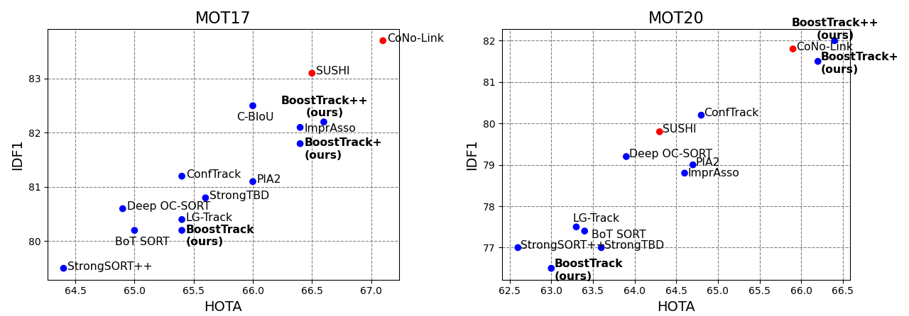
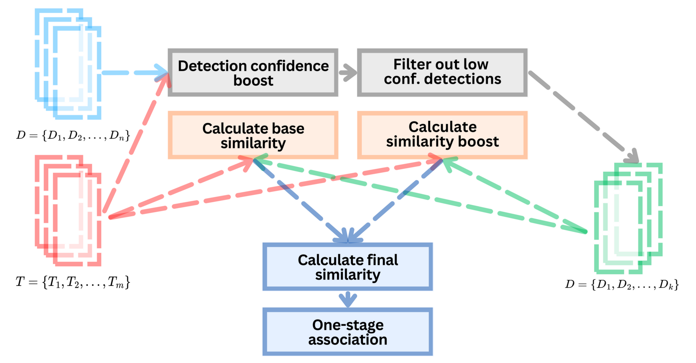

# BoostTrack/BoostTrack++ repository

> [**BoostTrack: Boosting the similarity measure and detection confidence for improved multiple object tracking**](https://doi.org/10.1007/s00138-024-01531-5)
> 
> 
> [**BoostTrack++: using tracklet information to detect more objects in multiple object tracking**](https://arxiv.org/abs/2408.13003)
> 
> Vukasin Stanojevic, Branimir Todorovic
> 

[](https://paperswithcode.com/sota/multi-object-tracking-on-mot17?p=boosttrack-using-tracklet-information-to)

[](https://paperswithcode.com/sota/multi-object-tracking-on-mot20-1?p=boosttrack-using-tracklet-information-to)
<p align="center"><br>HOTA and IDF1 scores on MOT17 and MOT20 datasets.</p>

## Abstract
Handling unreliable detections and avoiding identity switches are crucial for the success of multiple object tracking (MOT). Ideally, MOT algorithm should use true positive detections only, work in real-time and produce no identity switches. To approach the described ideal solution, we present the BoostTrack, a simple yet effective tracing-by-detection MOT method that utilizes several lightweight plug and play additions to improve MOT performance. We design a detection-tracklet confidence score and use it to scale the similarity measure and implicitly favour high detection confidence and high tracklet confidence pairs in one-stage association. To reduce the ambiguity arising from using intersection over union (IoU), we propose a novel Mahalanobis distance and shape similarity additions to boost the overall similarity measure. To utilize low-detection score bounding boxes in one-stage association, we propose to boost the confidence scores of two groups of detections:  the detections we assume to correspond to the existing tracked object, and the detections we assume to correspond to a previously undetected object. The proposed additions are orthogonal to the existing approaches, and we combine them with interpolation and camera motion compensation to achieve results comparable to the standard benchmark solutions while retaining real-time execution speed. When combined with appearance similarity, our method outperforms all standard benchmark solutions on MOT17 and MOT20 datasets. It ranks first among online methods in HOTA metric in the MOT Challenge on MOT17 and MOT20 test sets. 
<p align="center"></p>

## Tracking performance
### Results on MOT17 test set
| Method       | HOTA    | MOTA   | IDF1   |  IDSW  |
|--------------|---------|--------|--------|--------|
| BoostTrack   | 65.4    | 80.5   | 80.2   | 1104 |
| BoostTrack+  | 66.4    | 80.6   | 81.8   | 1086 |
| BoostTrack++ | 66.6    | 80.7   | 82.2   | 1062 |

### Results on MOT20 test set
| Method      | HOTA  | MOTA  |  IDF1  |  IDSW  |
|-------------|-------|-------|--------|--------|
|BoostTrack   | 63   | 76.4  | 76.5 | 992 |
|BoostTrack+  | 66.2 | 77.2  | 81.5 | 899 |
|BoostTrack++ | 66.4 | 77.7  | 82.0 | 762 |

## Installation
We tested the code on Ubuntu 22.04.

**Step 1.** Download repository and set up the conda environment.

Note: g++ is required to install all the requirements.
```shell
gh repo clone vukasin-stanojevic/BoostTrack
cd BoostTrack
conda env create -f boost-track-env.yml
conda activate boostTrack
```
Due to numpy version error, single line of code in mapping.py file from onnx module should be modified. The line 25 of the file should be replaced with the line:
```python
    int(TensorProto.STRING): np.dtype(object)
```

**Step 2.** Download the model weights and set up the datasets.

We use the same weights as [Deep OC-SORT](https://github.com/GerardMaggiolino/Deep-OC-SORT/tree/main). The weights can be downloaded from the [link](https://drive.google.com/drive/folders/15hZcR4bW_Z9hEaXXjeWhQl_jwRKllauG?usp=sharing).

*2.1.* Download the weights and place to BoostTrack/external/weights folder.

*2.2.* Download MOT17 and MOT20 datasets from the [MOT Challenge website](https://motchallenge.net/).

*2.3.* Place the files under BoostTrack/data folder:
```
data
|——————MOT17
|        └——————train
|        └——————test
|——————MOT20
|        └——————train
|        └——————test
```
*2.4.* Run:

```shell
python3 data/tools/convert_mot17_to_coco.py
python3 data/tools/convert_mot20_to_coco.py
```
## Running the experiments and evaluation
### Run BoostTrack
To run the BoostTrack on MOT17 and MOT20 validation sets run the following:
```shell
python main.py --dataset mot17 --exp_name BoostTrack --no_reid --btpp_arg_iou_boost --btpp_arg_no_sb --btpp_arg_no_vt
python main.py --dataset mot20 --exp_name BoostTrack --no_reid --btpp_arg_iou_boost --btpp_arg_no_sb --btpp_arg_no_vt
```
Note, three resulting folders will be created for each experiment: BoostTrack, BoostTrack_post, BoostTrack_post_gbi. The folders with the suffixes correspond to results with applied linear and gradient boosting interpolation. 

To evaluate the results using TrackEval run:
```shell
python external/TrackEval/scripts/run_mot_challenge.py   --SPLIT_TO_EVAL val   --GT_FOLDER results/gt/   --TRACKERS_FOLDER results/trackers/   --BENCHMARK MOT17  --TRACKERS_TO_EVAL BoostTrack_post_gbi
python external/TrackEval/scripts/run_mot_challenge.py   --SPLIT_TO_EVAL val   --GT_FOLDER results/gt/   --TRACKERS_FOLDER results/trackers/   --BENCHMARK MOT20  --TRACKERS_TO_EVAL BoostTrack_post_gbi 
```
### Run BoostTrack+
Similarly, to run the BoostTrack+ run:
```shell
python main.py --dataset mot17 --exp_name BoostTrackPlus --btpp_arg_iou_boost --btpp_arg_no_sb --btpp_arg_no_vt
python main.py --dataset mot20 --exp_name BoostTrackPlus --btpp_arg_iou_boost --btpp_arg_no_sb --btpp_arg_no_vt
```
To evaluate the BoostTrack+ results run:
```shell
python external/TrackEval/scripts/run_mot_challenge.py   --SPLIT_TO_EVAL val   --GT_FOLDER results/gt/   --TRACKERS_FOLDER results/trackers/   --BENCHMARK MOT17  --TRACKERS_TO_EVAL BoostTrackPlus_post_gbi
python external/TrackEval/scripts/run_mot_challenge.py   --SPLIT_TO_EVAL val   --GT_FOLDER results/gt/   --TRACKERS_FOLDER results/trackers/   --BENCHMARK MOT20  --TRACKERS_TO_EVAL BoostTrackPlus_post_gbi
```
### Run BoostTrack++
Finally, the default setting is to use BoostTrack++:
```shell
python main.py --dataset mot17 --exp_name BTPP
python main.py --dataset mot20 --exp_name BTPP
```
To evaluate the BoostTrack++ results run:
```shell
python external/TrackEval/scripts/run_mot_challenge.py   --SPLIT_TO_EVAL val   --GT_FOLDER results/gt/   --TRACKERS_FOLDER results/trackers/   --BENCHMARK MOT17  --TRACKERS_TO_EVAL BTPP_post_gbi
python external/TrackEval/scripts/run_mot_challenge.py   --SPLIT_TO_EVAL val   --GT_FOLDER results/gt/   --TRACKERS_FOLDER results/trackers/   --BENCHMARK MOT20  --TRACKERS_TO_EVAL BTPP_post_gbi
```

# Acknowledgements
Our implementation is developed on top of publicly available codes. We thank authors of [Deep OC-SORT](https://github.com/GerardMaggiolino/Deep-OC-SORT/), [SORT](https://github.com/abewley/sort), [StrongSort](https://github.com/dyhBUPT/StrongSORT), [NCT](https://github.com/Autoyou/Noise-control-multi-object-tracking), [ByteTrack](https://github.com/ifzhang/ByteTrack/) for making their code available. 

# Citation

If you find our work useful, please cite our papers: 
```
@article{stanojevic2024boostTrack,
  title={BoostTrack: boosting the similarity measure and detection confidence for improved multiple object tracking},
  author={Stanojevic, Vukasin D and Todorovic, Branimir T},
  journal={Machine Vision and Applications},
  issn = {0932-8092},
  year={2024},
  volume={35},
  number = {3},
  doi={10.1007/s00138-024-01531-5}
}

@article{stanojevic2024btpp,
      title={BoostTrack++: using tracklet information to detect more objects in multiple object tracking},
      author={Vuka\v{s}in Stanojevi\'c and Branimir Todorovi\'c},
      year={2024},
      eprint={2408.13003},
      archivePrefix={arXiv},
      primaryClass={cs.CV},
      doi={https://doi.org/10.48550/arXiv.2408.13003}
}
```

## A bug notice:
There is a bug in calculating shape similarity. 
It is supposed to be calculated as 
```math
S^{shape}_{d_i, t_j} = c_{d_i, t_j} \cdot \exp \biggl(-\big(\frac{|D_i^w - T_j^w|}{\text{max}(D_i^w, T_j^w)}  + \frac{|D_i^h - T_j^h|}{\text{max}(D_i^h, T_j^h)}\big)\biggr).
```
However, in the code, the equation is implemented (it is multiplied by detection-tracklet confidence later) as
```
np.exp(-(np.abs(dw - tw)/np.maximum(dw, tw) + np.abs(dh - th)/np.maximum(dw, tw)))
```
instead of 
```
np.exp(-(np.abs(dw - tw)/np.maximum(dw, tw) + np.abs(dh - th)/np.maximum(dh, th)))
```
Dividing both additions by the shorter dimension, i.e. width, penalizes shape mismatch more. Hyperparameters $\lambda_{IoU}, \lambda_{MhD}$ and $\lambda_{shape}$ are tuned to work with the original implementation, and using the correct implementation produces slightly worse results.
For this reason, we keep the implementation with the bug as function shape_similarity_v1, used by the default, and we provide the correct implementation in function shape_similarity_v2 (see file assoc.py).
Correct implementation can be used by passing the --s_sim_corr flag.

Changing the shape similarity implementation affects the results. We provide new results corresponding to the tables 1, 2 and 3 in the [following response](https://github.com/vukasin-stanojevic/BoostTrack/issues/8).

We thank Luong Duc Trong for detecting the bug.
